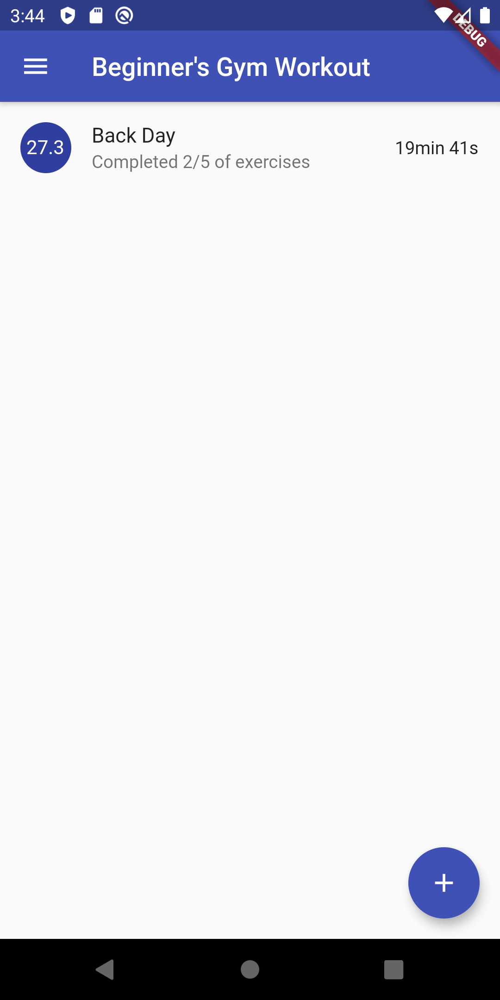
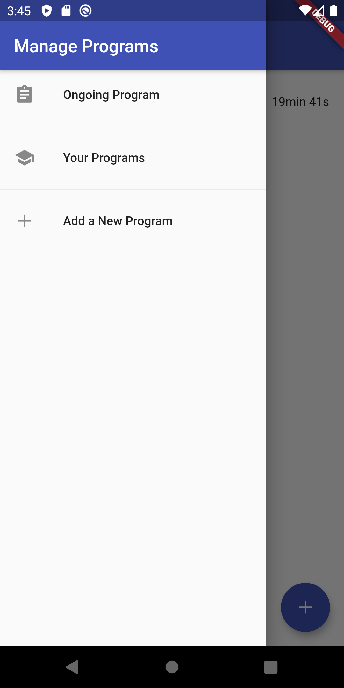
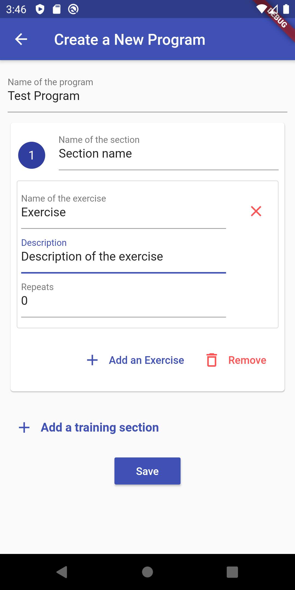
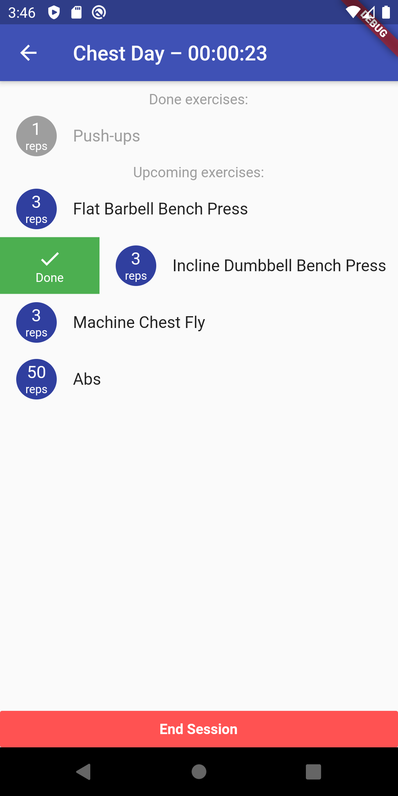

# gym_program

A new Flutter project.

## Requirements

* User must be able to
    - create gym programs
    - edit gym programs
    - inspect previous gym sessions
    - select a program to act as ongoing program
    - start a gym session
        - select desired program day (hands vs. legs vs. back etc.)
        - program should recommend the appropriate program day
    - end the ongoing gym session
    - see the progress of the program

* A gym program must have
    - possibility to create separate days inside a single program
    - a lenght in weeks
    - possibility to set the order of program days

## Models

* A session
    - id
    - date & time
    - duration of the session
    - reference to appropriate program day
    - completed exercises
* A program
    - id
    - name
    - program days
    - length (in cycles of program days)
* A program day
    - id
    - name
    - exercises
* An exercise
    - id
    - name
    - count of reps / minutes
    - description

## Screenshots v0.0.1

